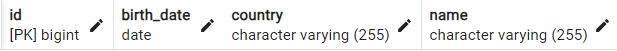
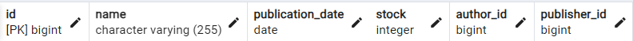
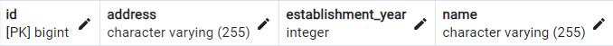
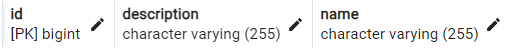
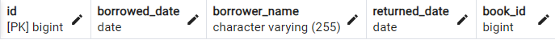

# Library Management System


This Maven Java project includes entity classes for books, authors, categories, publishers, and book borrowings, along with their defined relationships and cascade types.
## Technologies
* Java 22
* Spring Boot
* PostgreSQL 15
* IntelliJ IDEA Ultimate 2024.1.1 

## Dependencies
* Maven
* Lombok
* Spring Web
* Spring Boot DevTools
* Spring Data JPA

## Installation

1. To clone the project repository, run the following command in the terminal:
```bash
   git clone https://github.com/ikaraozdemir/
   ```
2. Navigate to the project folder in the terminal and run the following command:
   
```bash
   mvn spring-boot:run
```
3. Before running the application, update the application.properties file with your database configurations.
## Screenshots

- Author Table  
  

- Book Table  
  

- Publisher Table  
  

- Category Table  
  

- Book Borrowing Table  
  

- Join Table  
  

